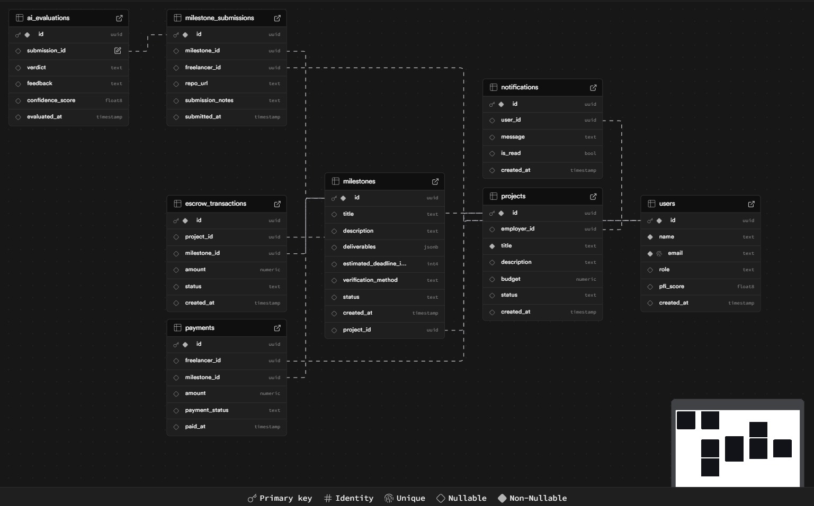
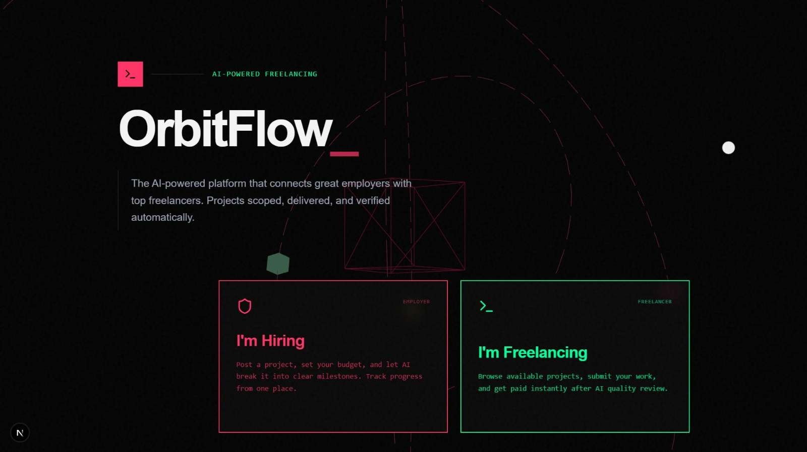
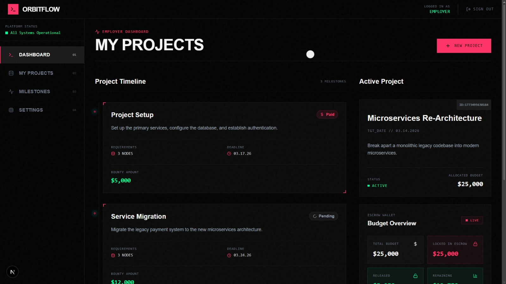
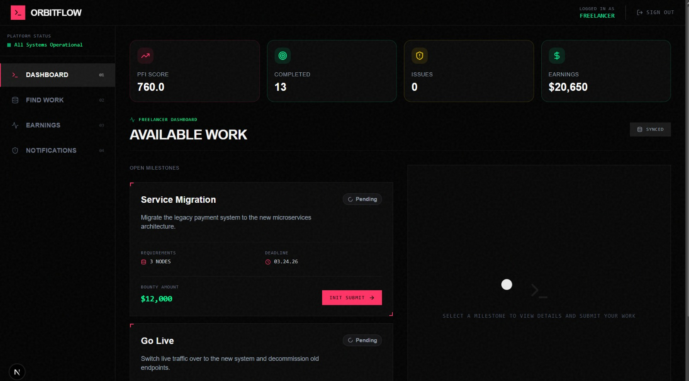

# ORBITFLOW
### AI-Driven Project Management, Verification, and Escrow Payments

---

## Overview

Modern freelance platforms suffer from a **trust gap** between employers and freelancers. Employers worry about paying for incomplete work, while freelancers face delayed or uncertain payments.

**Autonomous AI Freelance Agent** introduces an **AI intermediary** that manages the entire freelance project lifecycle — from requirement analysis to payment release.

The system automatically:

- Generates project milestones using AI
- Verifies submitted work through automated testing and AI analysis
- Releases escrow payments when work is verified
- Updates freelancer reputation using a dynamic scoring system

---

## Problem Statement

Freelance platforms today face several challenges:

### Lack of Clear Requirements
Employers often describe projects vaguely, which leads to misunderstandings about deliverables.

### Payment Uncertainty
Freelancers worry about delayed payments while employers worry about paying for incomplete work.

### Manual Verification
Most platforms rely on subjective reviews instead of objective verification of submitted work.

### Reputation Inflation
Current rating systems do not accurately reflect verified performance.

---

## Our Solution

Our platform introduces an **Autonomous AI Agent System** that automates project management and payment workflows.

The system performs four major tasks:

1. **Requirement Analysis**
   - Converts vague project descriptions into structured milestones.

2. **Automated Verification**
   - Evaluates submitted work using testing tools and AI code analysis.

3. **Autonomous Escrow Payments**
   - Releases payments automatically when milestones pass verification.

4. **Professional Fidelity Index (PFI)**
   - Updates freelancer reputation based on verified milestone completion.

---

## System Architecture

The platform integrates a modern web interface, API gateway, workflow automation, and AI agents to create a fully autonomous freelance project management system.


```
                          +---------------------------+
                          |        Frontend UI        |
                          |         (Next.js)         |
                          |   Employer / Freelancer   |
                          +-------------+-------------+
                                        |
                                        v
                          +---------------------------+
                          |       FastAPI Gateway     |
                          |     Handles API Requests  |
                          +-------------+-------------+
                                        |
                                        v
                          +---------------------------+
                          |        n8n Orchestrator   |
                          |     Workflow Automation   |
                          +-------------+-------------+
                                        |
                -----------------------------------------------------
                |                  |                 |               |
                v                  v                 v               v
        +---------------+  +---------------+  +---------------+  +---------------+
        | Milestone     |  | Verification  |  | Escrow        |  | Reputation    |
        | Generation    |  | Agent         |  | Payment Agent |  | Agent         |
        | Agent         |  |               |  |               |  |               |
        +-------+-------+  +-------+-------+  +-------+-------+  +-------+-------+
                \               |                 |               /
                 \              |                 |              /
                  ------------------------------------------------
                                  |
                                  v
                          +---------------------------+
                          |      Supabase Database    |
                          |                           |
                          |  - Projects               |
                          |  - Milestones             |
                          |  - Submissions            |
                          |  - Freelancer Reputation  |
                          +---------------------------+
```


Frontend (Next.js)
↓
FastAPI Gateway
↓
n8n Workflow Orchestrator
↓
AI Agents (Milestone | Verification | Escrow | Reputation)
↓
Supabase Database


---

## Workflow Overview

The project lifecycle is fully automated using AI agents.


Employer Creates Project
↓
AI Generates Milestones
↓
Freelancer Submits Work
↓
Verification Agent Analyzes Code
↓
Escrow Agent Releases Payment
↓
Reputation Agent Updates PFI


---

## n8n Workflow Automation

Our backend logic is implemented through **n8n workflows**, where each agent runs as an independent automated workflow.

---

### Milestone Generation Workflow

This workflow converts project descriptions into structured milestone plans.


Example flow:


Project Description
↓
AI Requirement Analysis
↓
Milestone Generation
↓
Database Storage


---

### Verification Workflow

This workflow evaluates submitted repositories.


Verification pipeline:


GitHub Repository Submission
↓
Repository Clone
↓
Run Automated Tests
↓
AI Code Evaluation
↓
Verification Result


---

### Escrow Payment Workflow

Once a milestone is verified, payment is automatically released.


Verification PASS
↓
Escrow Trigger
↓
Payment Release
↓
Transaction Confirmation


---

### Reputation Update Workflow

Freelancer reputation is updated based on verified performance.


Milestone Completion
↓
Performance Evaluation
↓
PFI Score Update


---

## Database Design

The system uses **Supabase (PostgreSQL)** for storing platform data.



Key tables include:

### Projects

projects

id
title
description
budget
status
created_at


### Milestones

milestones

id
project_id
title
description
payout_percentage
status


### Submissions

submissions

id
milestone_id
repo_url
verification_status


### Freelancers

freelancers

id
wallet_address
pfi_score
successful_milestones
total_milestones


---

## Frontend Interface

The frontend provides a clean and modern interface for both employers and freelancers.

---

### Landing Page



Provides a quick overview of the system and its benefits.

---

### Employer Dashboard



Features:

- Create new projects
- Generate AI milestones
- Track milestone progress

---

### Freelancer Workspace



Allows freelancers to:

- View assigned milestones
- Submit repository links
- Track verification status

---


Requirement Agent → Generating milestones
Verification Agent → Running automated tests
Escrow Agent → Releasing milestone payment
Reputation Agent → Updating freelancer PFI


---

## Tech Stack

Frontend  
- Next.js  
- TailwindCSS  
- Framer Motion  

Backend  
- FastAPI  

Automation  
- n8n Workflow Automation  

Database  
- Supabase (PostgreSQL)

AI  
- Large Language Models for requirement analysis and code evaluation

---

## Demo Video

Watch the demo here:


[Insert Demo Video Link Here]


---

## Future Improvements

Potential improvements include:

- Blockchain-based escrow payments
- DAO-based dispute resolution
- Multi-agent collaboration for complex projects
- AI-generated project contracts

---

## Impact

By automating verification and payment processes, this system creates a **trust-minimized freelance ecosystem** where:

- Employers pay only for verified work
- Freelancers receive instant payments
- Reputation reflects real performance

---

## Contributors

- Swapnil Jain
- Ojaswi Joshi
- Ayush Kathal
- Arnav Timble
- Arnab Mistry

---

## License

This project was developed for a hackathon and is available for educational purposes.
